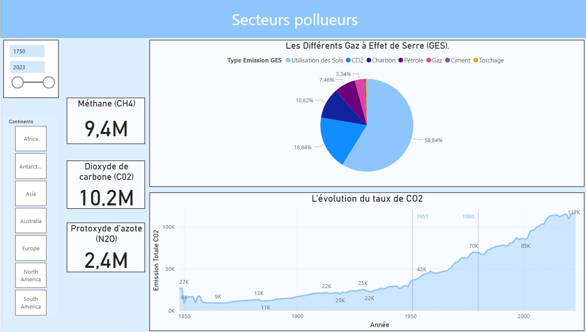
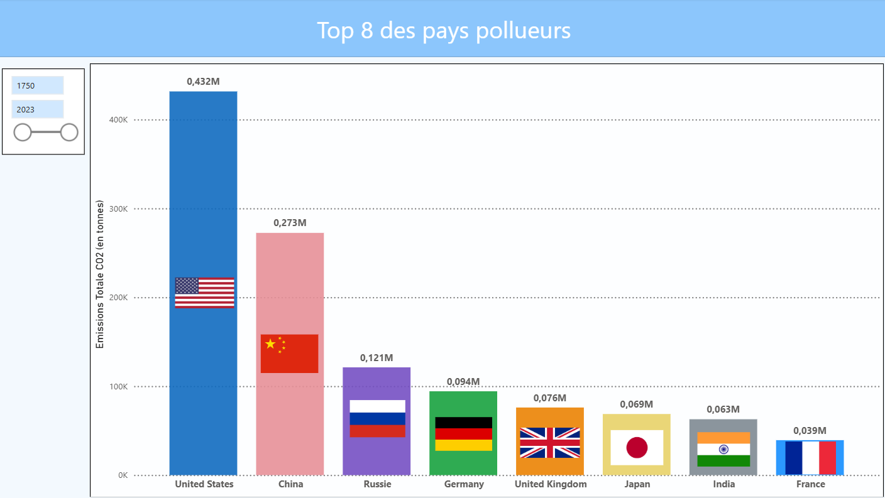

# Analyse des données climatiques

## Objectif
Analyser l’évolution des températures à partir de données historiques.

## Outils utilisés
- Python (Pandas, Matplotlib)
- SQL
- Power BI
- Excel

## Étapes
- Nettoyage des données avec python
- Analyse exploratoire (EDA) avec python
- Création de visualisations avec python et Power BI
- Mise en place de KPI avec Power BI

## Résultats
- Identification de tendances climatiques
- Création d’un dashboard Power BI

## Aperçu
- Les secteurs qui polluent le plus de CO2

- Top 8 des pays les plus pollueurs dans le monde

